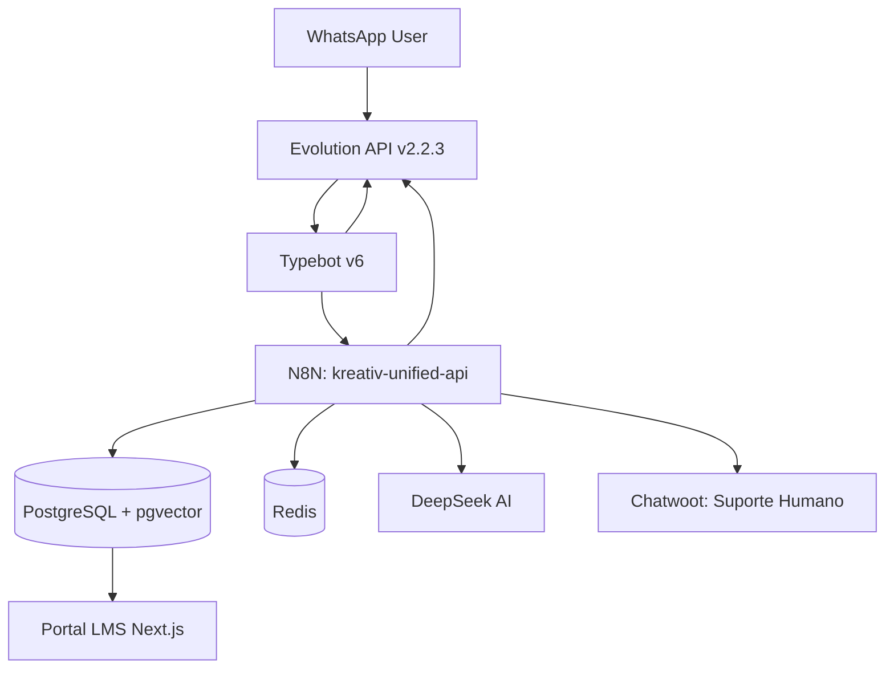

# Arquitetura do Ecossistema Kreativ Educação

Última atualização: 21/02/2026

## Visão Geral

Sistema de educação conversacional via WhatsApp com IA, gamificação e LMS.
Todos os serviços rodam em containers Docker em VPS Hostinger (7.8GB RAM), orquestrados pelo Traefik.



## Fluxo Principal

```
WhatsApp → Evolution API → Typebot v6 → N8N (Unified API) → PostgreSQL
                                    ↑
                              resposta de volta
```

1. Usuário envia mensagem no WhatsApp
2. Evolution API (instância `europs`, `TYPEBOT_ENABLED=true`) repassa para Typebot
3. Typebot executa o fluxo visual — blocos `"Webhook"` (capital W) fazem chamadas HTTP para N8N
4. N8N executa lógica de negócio (consulta DB, chama DeepSeek, atualiza progresso)
5. Resposta volta via Typebot → Evolution API → WhatsApp

## Serviços e Responsabilidades

| Serviço | Imagem | Função |
|---------|--------|--------|
| kreativ_postgres | pgvector/pgvector:pg16 | Banco principal + embeddings RAG |
| kreativ_redis | redis:7-alpine | Cache, idempotência, sessões |
| kreativ_evolution | atendai/evolution-api:v2.2.3 | Conector WhatsApp (Baileys unofficial) |
| kreativ_n8n | n8nio/n8n:latest | Automação e lógica de negócio |
| kreativ_typebot_builder | typebot/builder:latest | Editor visual do bot |
| kreativ_typebot_viewer | typebot/viewer:latest | Runtime do bot (executa fluxo) |
| kreativ_chatwoot | chatwoot/chatwoot:v3.15.0 | CRM para suporte humano |
| kreativ_tooljet | tooljet/tooljet:latest | Painel administrativo |
| kreativ_metabase | metabase/metabase:latest | Analytics e dashboards |
| kreativ_portal | build ./apps/portal | LMS: portal do aluno + certificados |
| kreativ_minio | minio/minio:latest | Storage S3 (certificados, PDFs) |
| kreativ_postfix | build local | SMTP para e-mails transacionais |

> BuilderBot: container presente no docker-compose mas fora do fluxo ativo — substituído pelo Typebot.

## Camada 1 — Comunicação (Evolution API)

- Instância ativa: `europs`
- Modo: `TYPEBOT_ENABLED=true` — todas as mensagens são roteadas para o Typebot
- URL Typebot configurada: `http://kreativ_typebot_viewer:3000`
- Webhook N8N: **desabilitado** (Evolution não envia mais para N8N diretamente)

## Camada 2 — Bot Visual (Typebot v6)

- Bot: "Kreativ Educacao" | ID: `vnp6x9bqwrx54b2pct5dhqlb`
- Viewer: https://bot.extensionista.site/kreativ-educacao
- **Regra crítica de blocos:**
  - `"webhook"` (lowercase) = aguarda chamada do cliente → Evolution API ignora → **NÃO USAR**
  - `"Webhook"` (capital W) = executa HTTP server-side → **USAR SEMPRE**
- Deploy via DB injection (UPDATE `Typebot` + `PublicTypebot` em `typebot_db`)
- Script de rebuild: `scripts/build_typebot.py`

## Camada 3 — Automação (N8N)

Endpoint unificado: `POST /webhook/kreativ-unified-api`

| Ação | Descrição |
|------|-----------|
| `check_student` | Verifica se telefone está cadastrado, retorna módulo atual |
| `get_module` | Busca conteúdo do módulo atual do aluno |
| `submit_quiz` | Registra resposta do quiz (avaliação DeepSeek a implementar) |
| `get_progress` | Retorna progresso e certificados do aluno |
| `request_human` | Escala para atendente no Chatwoot |

N8N acessa PostgreSQL **diretamente** (sem proxy intermediário) usando hostname `kreativ_postgres`.

## Camada 4 — Dados (PostgreSQL)

Banco principal `kreativ_edu`. Tabelas-chave:

| Tabela | Descrição |
|--------|-----------|
| courses | 21 cursos cadastrados |
| modules | Conteúdo por módulo (`course_int_id` INTEGER FK → courses.id) |
| students | Alunos matriculados + `portal_token` UUID |
| pre_inscriptions | 508 pré-inscritos importados |
| quiz_questions | Perguntas JSONB por módulo |
| certificates | Certificados emitidos (verification_code) |
| document_chunks | Embeddings RAG (vector 1536) — a popular |
| handoff_control | Estado bot/humano por telefone |

> `modules.course_int_id` (INTEGER) para JOINs — NÃO usar `course_id` (VARCHAR)

## Camada 5 — LMS (Portal do Aluno)

- URL: https://portal.extensionista.site/aluno/[portal_token]
- `/aluno/[token]` — dashboard com progresso, módulos, certificados
- `/modulo/[id]` — conteúdo com YouTube embed + quiz
- `/certificado/[id]` — validação pública por verification_code

## Limitações Conhecidas

### Botões WhatsApp
Typebot `Choice Input` blocks renderizam como **texto com emojis**, não como botões interativos nativos.
- Solução imediata: usar texto com sintaxe `[buttons]` suportada pela Evolution API (Baileys)
- Solução definitiva: migrar para Cloud API Meta (suporte a botões oficiais)

### Evolution API — Baileys vs Cloud API
- Atual (Baileys): unofficial, pode ser bloqueado pela Meta, limitações em mídias ricas
- Cloud API Meta: oficial, suporte a botões/listas interativas, requer aprovação Meta Business

### RAG
- `document_chunks` existe mas está vazio (0 rows)
- AI Router V3 tem nó RAG pronto mas sem conteúdo para buscar

## Roadmap Próximos Passos

- **Fase 3A:** Corrigir renderização de botões (texto `[buttons]`/`[list]` no Typebot)
- **Fase 3B:** Implementar avaliação DeepSeek no `submit_quiz` do N8N
- **Fase 4:** Popular RAG (`document_chunks`) com conteúdo dos cursos
- **Fase 5:** Migrar Evolution para Cloud API Meta (botões oficiais)
